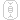
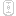

# Icons
Low-pixel icons are hand drawn with [Pixelorama](https://github.com/Orama-Interactive/Pixelorama).

High-pixel icon is drawn in [Inkscape](https://inkscape.org/).

### Scaled SVGs

### Pixel Graphics

### Building the Iconsets
Run `make` here or `make -C Icons` in the root.
